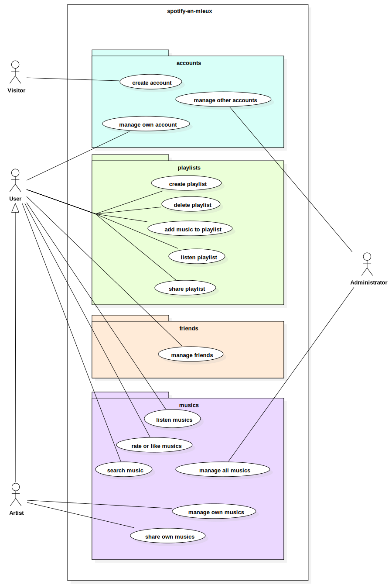
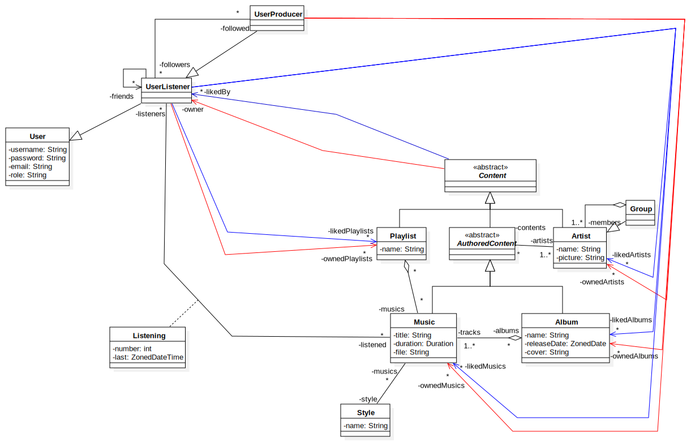

# spotify-en-mieux

## Fonctionnalités

- écouter de la musique
- partager de la musique
- recommander / suggérer des musiques
- télécharger de la musique
- controle vocal (on va pas faire ça, trop compliqué)
- chercher musique (par artiste, titre, album, ...) et trier (par artiste, titre, album, ...)
- liker musiques
- reseau social (amis ? public / private ?)
- gerer de la musique (compte > user)
    - ajouter / supprimer / modifier
- compte (user / artist / admin ?)
    - créer / modifier / supprimer
    - login/logout
- playlist
    - créer
    - supprimer
    - ajouter
    - écouter

## Diagramme de cas d'utilisation

## Diagramme de classes

